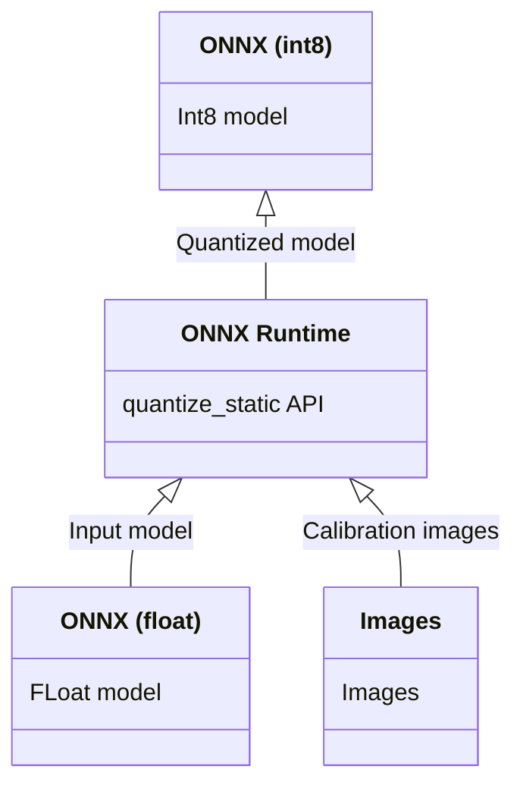

# onnx-quantization

This is a example to quantize onnx. The input is onnx of float. Quantization is done using onnxruntime. The output is onnx of int8.

## Requirements

- onnxruntime 1.13.1
- onnx 1.13.0

## Architecture



## Calibration images

The default is to quantize using only 2 images, which is less accurate.
Place imagenet validation images in the imagenet_val folder or coco2017 images folder to improve quantization accuracy.
(like --calibrate_dataset E:/git/ailia-models-measurement/object_detection/data/coco2017/images)

## Quantization command

Quantization can be performed with the following command. 

Yolo-v8 from Ultralytics

```
python quantize.py --input_model ./models/240321_v8obb_N1024_6cls_e31.onnx --output_model ./onnx-quantization/v8obb.onnx --calibrate_dataset ./datasets/obb_test/dataset/images/train
```

## Test

Inference using quantized yolox can be executed with the following command.

```
cd test
python3 yolox.py
```

## Output

- [mobilenev2_quantized.onnx](./models/mobilenev2_quantized.onnx)
- [yolov3-tiny_quantized_per_tensor.onnx](./models/yolov3-tiny_quantized_per_tensor.onnx)
- [yolox_tiny_quantized_per_channel.onnx](./models/yolox_tiny_quantized_per_channel.onnx)
- [yolox_tiny_quantized_per_tensor.onnx](./models/yolox_tiny_quantized_per_tensor.onnx)

## Limitation

Per-Channel support with QDQ format requires onnx opset version 13 or above.

## Reference

- [Official sample](https://onnxruntime.ai/docs/performance/quantization.html)
- [Official document](https://github.com/microsoft/onnxruntime-inference-examples/tree/main/quantization/image_classification/cpu)
